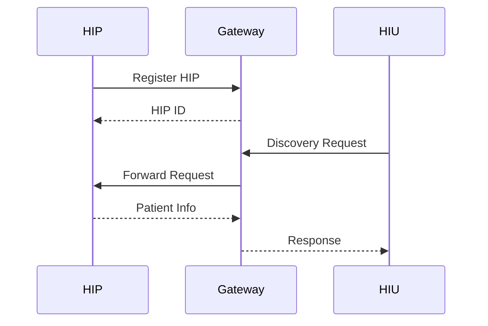
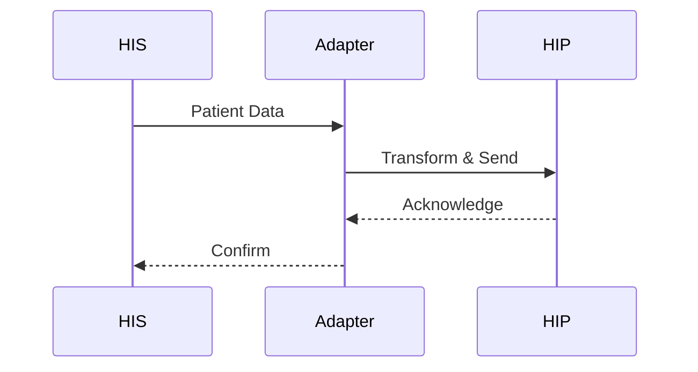

# API Documentation

## Base URLs
- Development: `http://localhost:3000`
- Staging: `https://hip-staging.example.com`
- Production: `https://hip.example.com`

## Authentication

All API requests must be authenticated using JWT tokens. Include the token in the Authorization header:

```
Authorization: Bearer <token>
```

### Required Headers
```
X-HIP-ID: <your_hip_id>
REQUEST-ID: <uuid>
TIMESTAMP: <ISO8601_timestamp>
```

## API Endpoints

### 1. Authentication Service

#### Generate Token
```http
POST /auth/token
Content-Type: application/json

{
  "clientId": "string",
  "clientSecret": "string"
}
```

**Response**:
```json
{
  "accessToken": "string",
  "refreshToken": "string",
  "expiresIn": 3600
}
```

#### Refresh Token
```http
POST /auth/token/refresh
Content-Type: application/json

{
  "refreshToken": "string"
}
```

### 2. Patient Service

#### Register Patient
```http
POST /patient/register
Content-Type: application/json

{
  "abhaNumber": "string",
  "name": "string",
  "gender": "M|F|O",
  "dateOfBirth": "YYYY-MM-DD",
  "address": {
    "line": "string",
    "district": "string",
    "state": "string",
    "pincode": "string"
  },
  "identifiers": [{
    "type": "MOBILE|EMAIL",
    "value": "string"
  }]
}
```

**Response**:
```json
{
  "patientId": "uuid",
  "abhaNumber": "string",
  "status": "ACTIVE",
  "createdAt": "timestamp"
}
```

#### Search Patient
```http
GET /patient/search?abhaNumber=string&phone=string
```

**Response**:
```json
{
  "patients": [{
    "id": "uuid",
    "abhaNumber": "string",
    "name": "string",
    "gender": "string",
    "yearOfBirth": "number"
  }]
}
```

### 3. Care Context Service

#### Add Care Context
```http
POST /care-context/add
Content-Type: application/json

{
  "patientId": "uuid",
  "careContexts": [{
    "reference": "string",
    "display": "string",
    "type": "OPD|IPD|DIAGNOSTIC",
    "metadata": {
      "key": "value"
    }
  }]
}
```

**Response**:
```json
{
  "careContexts": [{
    "id": "uuid",
    "reference": "string",
    "display": "string",
    "createdAt": "timestamp"
  }]
}
```

### 4. Consent Service

#### Create Consent Request
```http
POST /consent/request
Content-Type: application/json

{
  "patientId": "uuid",
  "purpose": {
    "code": "string",
    "text": "string"
  },
  "hiTypes": ["OPConsultation", "DiagnosticReport"],
  "permission": {
    "dateRange": {
      "from": "timestamp",
      "to": "timestamp"
    },
    "dataEraseAt": "timestamp"
  }
}
```

**Response**:
```json
{
  "consentRequestId": "uuid",
  "status": "REQUESTED",
  "createdAt": "timestamp"
}
```

#### Consent Notification Callback
```http
POST /consent/notification
Content-Type: application/json

{
  "consentRequestId": "uuid",
  "status": "GRANTED|DENIED|EXPIRED",
  "consentArtefact": {
    "id": "uuid",
    "signature": "string",
    "details": {}
  }
}
```

### 5. Health Records Service

#### Store Health Record
```http
POST /health-records/store
Content-Type: application/json

{
  "patientId": "uuid",
  "careContextId": "uuid",
  "recordType": "OPConsultation|Prescription|DiagnosticReport",
  "data": {
    "resourceType": "string",
    "content": {}
  },
  "attachments": [{
    "contentType": "string",
    "data": "base64",
    "hash": "string"
  }]
}
```

**Response**:
```json
{
  "recordId": "uuid",
  "status": "STORED",
  "timestamp": "timestamp"
}
```

#### Retrieve Health Records
```http
GET /health-records/fetch
Content-Type: application/json

{
  "consentArtefactId": "uuid",
  "dateRange": {
    "from": "timestamp",
    "to": "timestamp"
  },
  "hiTypes": ["string"]
}
```

## Error Responses

### Standard Error Format
```json
{
  "error": {
    "code": "string",
    "message": "string",
    "details": {}
  },
  "requestId": "uuid",
  "timestamp": "timestamp"
}
```

### Common Error Codes

| Code | Description |
|------|-------------|
| AUTH001 | Invalid credentials |
| AUTH002 | Token expired |
| PAT001 | Patient not found |
| PAT002 | Invalid ABHA number |
| CON001 | Invalid consent request |
| CON002 | Consent expired |
| HEA001 | Record not found |
| HEA002 | Invalid record format |

## Webhook Endpoints

### 1. Consent Notifications
```http
POST /webhook/consent
Content-Type: application/json

{
  "type": "CONSENT_REQUESTED|CONSENT_GRANTED|CONSENT_REVOKED",
  "timestamp": "ISO8601",
  "data": {
    "consentId": "string",
    "status": "string",
    "details": {}
  }
}
```

### 2. Health Information Requests
```http
POST /webhook/health-info
Content-Type: application/json

{
  "type": "DATA_REQUESTED|DATA_TRANSFERRED",
  "timestamp": "ISO8601",
  "data": {
    "transactionId": "string",
    "consentId": "string",
    "details": {}
  }
}
```

## Rate Limits

| Endpoint | Rate Limit |
|----------|------------|
| /auth/* | 10 requests/minute |
| /patient/* | 30 requests/minute |
| /consent/* | 50 requests/minute |
| /health-records/* | 100 requests/minute |

## Data Formats

### 1. Patient Identifier Types
- MOBILE
- EMAIL
- ABHA
- MRN (Medical Record Number)

### 2. Health Information Types
- OPConsultation
- Prescription
- DiagnosticReport
- DischargeSummary
- ImmunizationRecord
- HealthDocumentRecord
- WellnessRecord

### 3. Consent Purpose Codes
- CAREMGT (Care Management)
- BTG (Break the Glass)
- PUBHLTH (Public Health)
- HPAYMT (Healthcare Payment)
- DSRCH (Disease Specific Healthcare Research)
- SELF (Self Requested)

## Security Requirements

### 1. Authentication
- JWT token required for all endpoints
- Token expiry: 1 hour
- Refresh token expiry: 30 days

### 2. Authorization
- Role-based access control
- Scope-based permissions
- IP whitelisting for sensitive endpoints

### 3. Data Protection
- All PHI must be encrypted at rest
- TLS 1.3 required for transport
- Field-level encryption for sensitive data

## Integration Guidelines

### 1. ABDM Gateway Integration


### 2. Hospital System Integration


## Implementation Notes

### 1. Request Validation
- All request bodies must be validated against JSON schemas
- Timestamps must be in ISO8601 format
- UUIDs must follow RFC4122 version 4

### 2. Response Handling
- Use appropriate HTTP status codes
- Include request ID in all responses
- Follow consistent error format

### 3. Monitoring
- Log all API requests
- Track response times
- Monitor error rates
- Set up alerts for anomalies 