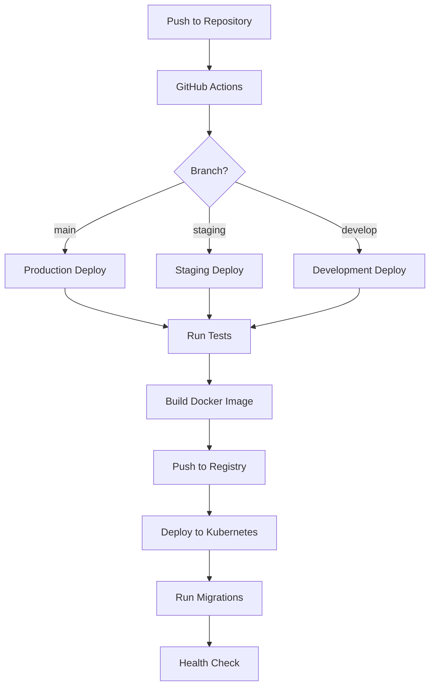

# Dependencies and Deployment Guide

## Dependencies

### Core Dependencies

```json
{
  "dependencies": {
    "express": "^4.18.2",
    "typescript": "^5.0.0",
    "@types/node": "^18.0.0",
    "@types/express": "^4.17.17",
    "pg": "^8.11.0",
    "typeorm": "^0.3.17",
    "redis": "^4.6.7",
    "elasticsearch": "^16.7.3",
    "jsonwebtoken": "^9.0.0",
    "bcrypt": "^5.1.0",
    "winston": "^3.9.0",
    "joi": "^17.9.2",
    "axios": "^1.4.0",
    "cors": "^2.8.5",
    "helmet": "^7.0.0",
    "compression": "^1.7.4",
    "dotenv": "^16.3.1"
  },
  "devDependencies": {
    "jest": "^29.5.0",
    "@types/jest": "^29.5.2",
    "ts-jest": "^29.1.0",
    "supertest": "^6.3.3",
    "@types/supertest": "^2.0.12",
    "nodemon": "^2.0.22",
    "ts-node": "^10.9.1",
    "eslint": "^8.42.0",
    "@typescript-eslint/parser": "^5.59.9",
    "@typescript-eslint/eslint-plugin": "^5.59.9",
    "prettier": "^2.8.8"
  }
}
```

### Infrastructure Dependencies

1. **Docker**
   - Docker Engine: 24.0.0+
   - Docker Compose: 2.18.0+

2. **Kubernetes**
   - Kubernetes: 1.26+
   - kubectl: 1.26+
   - Helm: 3.12+

3. **Databases**
   - PostgreSQL: 15.x
   - Redis: 7.x
   - Elasticsearch: 8.x

4. **Monitoring**
   - Prometheus: 2.44+
   - Grafana: 9.5+
   - Jaeger: 1.45+

## Environment Setup

### 1. Development Environment

#### Prerequisites
```bash
# Node.js and npm
curl -fsSL https://deb.nodesource.com/setup_18.x | sudo -E bash -
sudo apt-get install -y nodejs

# Docker
curl -fsSL https://get.docker.com -o get-docker.sh
sudo sh get-docker.sh

# Docker Compose
sudo curl -L "https://github.com/docker/compose/releases/download/v2.18.0/docker-compose-$(uname -s)-$(uname -m)" -o /usr/local/bin/docker-compose
sudo chmod +x /usr/local/bin/docker-compose
```

#### Environment Variables
```bash
# .env.development
NODE_ENV=development
PORT=3000

# Database
DB_HOST=localhost
DB_PORT=5432
DB_USER=postgres
DB_PASSWORD=postgres
DB_NAME=hip_dev

# Redis
REDIS_HOST=localhost
REDIS_PORT=6379

# Elasticsearch
ES_HOST=localhost
ES_PORT=9200

# JWT
JWT_SECRET=your_jwt_secret
JWT_EXPIRY=1h

# ABDM Gateway
ABDM_GATEWAY_URL=https://dev.abdm.gov.in/gateway
ABDM_CLIENT_ID=your_client_id
ABDM_CLIENT_SECRET=your_client_secret
```

#### Local Setup
```bash
# Install dependencies
npm install

# Start development services
docker-compose -f docker/development/docker-compose.yml up -d

# Run migrations
npm run typeorm migration:run

# Start development server
npm run dev
```

### 2. Production Environment

#### Prerequisites
```bash
# Install kubectl
curl -LO "https://dl.k8s.io/release/$(curl -L -s https://dl.k8s.io/release/stable.txt)/bin/linux/amd64/kubectl"
sudo install -o root -g root -m 0755 kubectl /usr/local/bin/kubectl

# Install Helm
curl https://raw.githubusercontent.com/helm/helm/main/scripts/get-helm-3 | bash
```

#### Environment Variables
```bash
# .env.production
NODE_ENV=production
PORT=3000

# Database
DB_HOST=postgres.production
DB_PORT=5432
DB_USER=prod_user
DB_PASSWORD=secure_password
DB_NAME=hip_prod

# Redis
REDIS_HOST=redis.production
REDIS_PORT=6379

# Elasticsearch
ES_HOST=elasticsearch.production
ES_PORT=9200

# JWT
JWT_SECRET=secure_jwt_secret
JWT_EXPIRY=1h

# ABDM Gateway
ABDM_GATEWAY_URL=https://abdm.gov.in/gateway
ABDM_CLIENT_ID=prod_client_id
ABDM_CLIENT_SECRET=prod_client_secret
```

## Deployment Strategy

### 1. CI/CD Pipeline



### 2. Kubernetes Deployment

#### Base Configuration
```yaml
# kubernetes/base/deployments/app.yaml
apiVersion: apps/v1
kind: Deployment
metadata:
  name: hip-service
spec:
  replicas: 3
  selector:
    matchLabels:
      app: hip-service
  template:
    metadata:
      labels:
        app: hip-service
    spec:
      containers:
      - name: hip-service
        image: hip-service:latest
        ports:
        - containerPort: 3000
        envFrom:
        - configMapRef:
            name: hip-config
        - secretRef:
            name: hip-secrets
        resources:
          requests:
            memory: "256Mi"
            cpu: "200m"
          limits:
            memory: "512Mi"
            cpu: "500m"
```

### 3. Deployment Process

1. **Build Phase**
   ```bash
   # Build Docker image
   docker build -t hip-service:${VERSION} -f docker/production/Dockerfile .
   
   # Push to registry
   docker push hip-service:${VERSION}
   ```

2. **Deploy Phase**
   ```bash
   # Update Kubernetes configs
   kubectl apply -k kubernetes/overlays/production
   
   # Verify deployment
   kubectl get deployments
   kubectl get pods
   ```

3. **Post-deployment**
   ```bash
   # Run database migrations
   kubectl exec -it $(kubectl get pods -l app=hip-service -o jsonpath="{.items[0].metadata.name}") -- npm run typeorm migration:run
   
   # Verify health
   kubectl exec -it $(kubectl get pods -l app=hip-service -o jsonpath="{.items[0].metadata.name}") -- curl localhost:3000/health
   ```

### 4. Monitoring Setup

1. **Prometheus Configuration**
   ```yaml
   # config/monitoring/prometheus/config.yaml
   global:
     scrape_interval: 15s
   
   scrape_configs:
     - job_name: 'hip-service'
       static_configs:
         - targets: ['hip-service:3000']
   ```

2. **Grafana Dashboards**
   ```yaml
   # config/monitoring/grafana/dashboards/hip-service.json
   {
     "dashboard": {
       "title": "HIP Service Metrics",
       "panels": [
         {
           "title": "Request Rate",
           "type": "graph"
         },
         {
           "title": "Error Rate",
           "type": "graph"
         },
         {
           "title": "Response Time",
           "type": "graph"
         }
       ]
     }
   }
   ```

### 5. Backup Strategy

1. **Database Backups**
   ```bash
   # Daily backups
   0 0 * * * kubectl exec -it $(kubectl get pods -l app=postgres -o jsonpath="{.items[0].metadata.name}") -- pg_dump -U postgres hip_prod > backup_$(date +%Y%m%d).sql
   
   # Retain for 30 days
   find /backups -name "backup_*.sql" -mtime +30 -delete
   ```

2. **Log Retention**
   ```yaml
   # config/monitoring/elasticsearch/lifecycle-policy.json
   {
     "policy": {
       "phases": {
         "hot": {
           "actions": {
             "rollover": {
               "max_size": "50GB",
               "max_age": "7d"
             }
           }
         },
         "delete": {
           "min_age": "30d",
           "actions": {
             "delete": {}
           }
         }
       }
     }
   }
   ```

## Scaling Strategy

### 1. Horizontal Pod Autoscaling
```yaml
apiVersion: autoscaling/v2
kind: HorizontalPodAutoscaler
metadata:
  name: hip-service-hpa
spec:
  scaleTargetRef:
    apiVersion: apps/v1
    kind: Deployment
    name: hip-service
  minReplicas: 3
  maxReplicas: 10
  metrics:
  - type: Resource
    resource:
      name: cpu
      target:
        type: Utilization
        averageUtilization: 70
```

### 2. Database Scaling
- Read replicas for PostgreSQL
- Redis cluster for caching
- Elasticsearch cluster for search

## Rollback Procedures

1. **Application Rollback**
   ```bash
   # Rollback deployment
   kubectl rollout undo deployment/hip-service
   
   # Verify rollback
   kubectl rollout status deployment/hip-service
   ```

2. **Database Rollback**
   ```bash
   # Revert migration
   npm run typeorm migration:revert
   
   # Restore from backup if needed
   kubectl exec -it postgres-0 -- psql -U postgres hip_prod < backup_file.sql
   ``` 