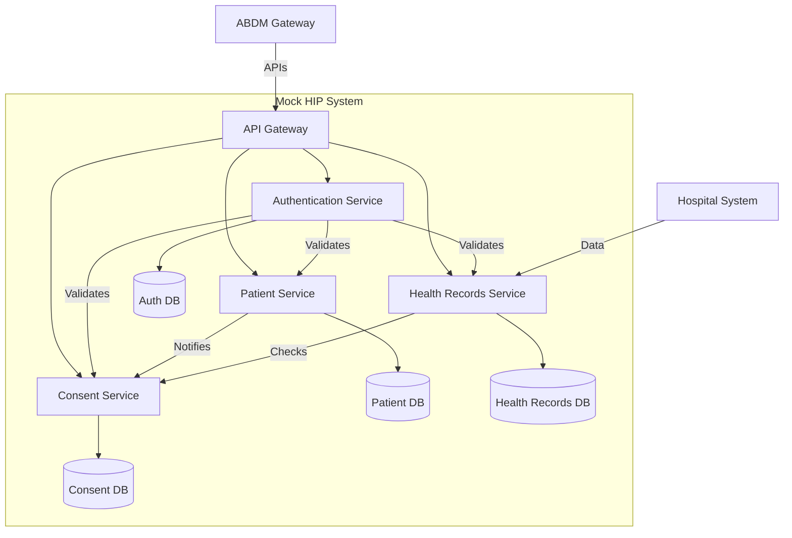
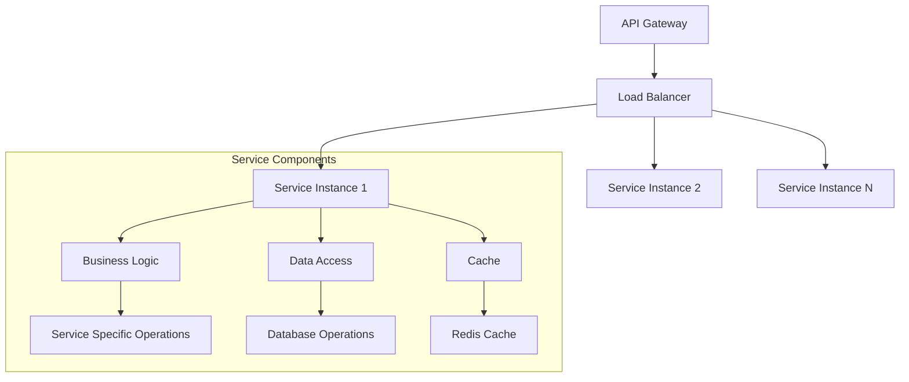
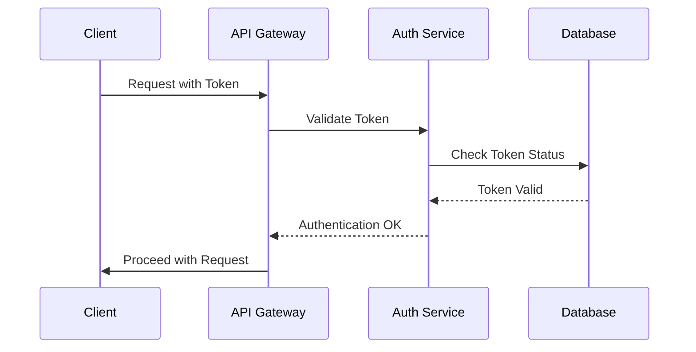
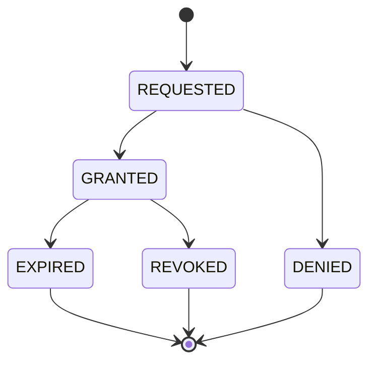
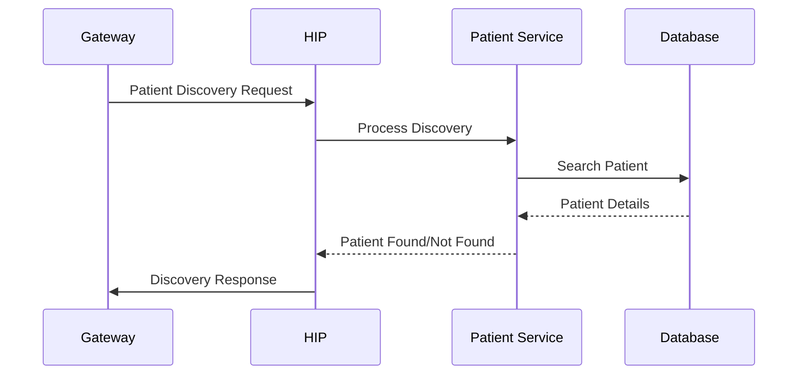
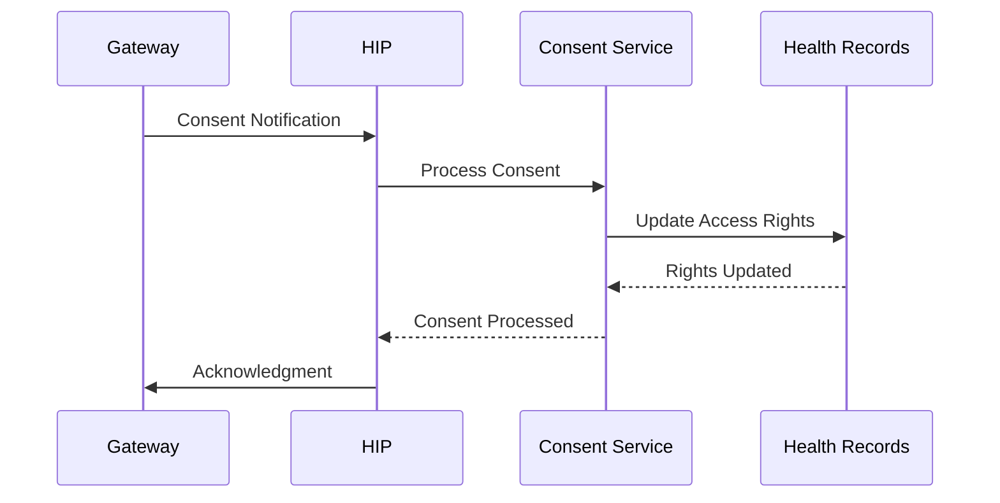
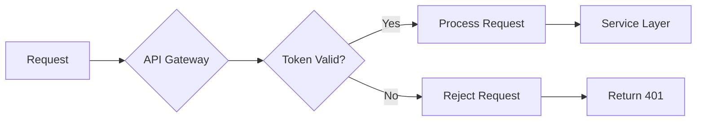
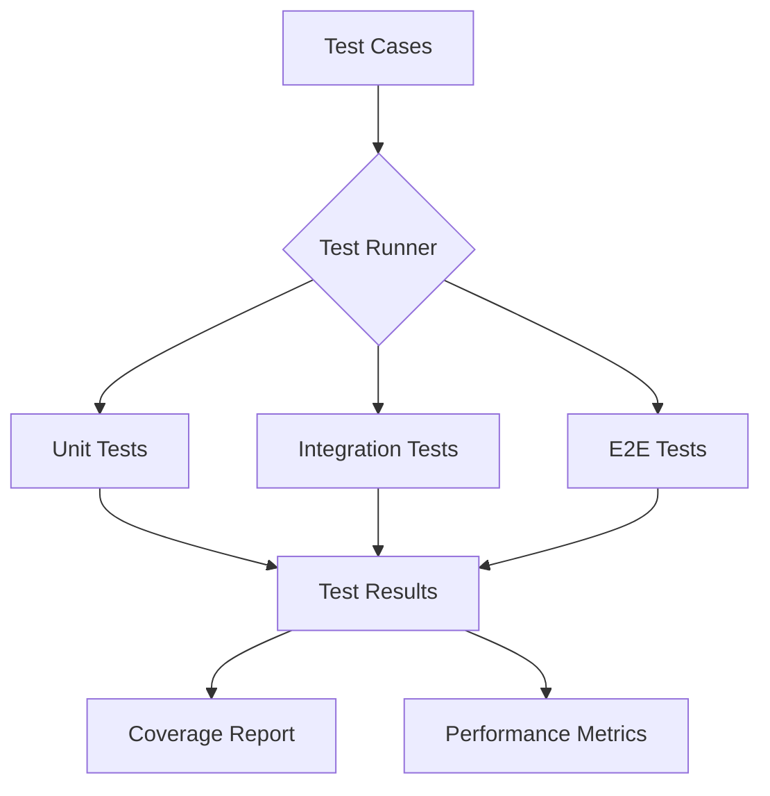
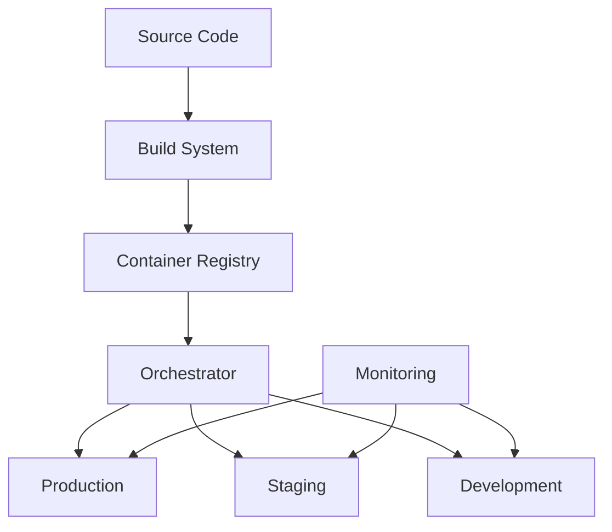

# Mock HIP System Design Document

## Table of Contents
1. [System Overview](#system-overview)
2. [Architecture](#architecture)
3. [Component Details](#component-details)
4. [Data Flows](#data-flows)
5. [Security Architecture](#security-architecture)
6. [Development Sequence](#development-sequence)
7. [Testing Strategy](#testing-strategy)

## System Overview

The Mock Health Information Provider (HIP) system is designed to simulate a healthcare facility's integration with the Ayushman Bharat Digital Mission (ABDM) ecosystem. This system implements all necessary APIs and workflows to interact with ABDM Gateway, handle patient data, manage consents, and facilitate health information exchange.

### Key Features
- Patient Discovery and Linking
- Care Context Management
- Consent Management
- Health Records Management
- ABDM Gateway Integration
- Security and Compliance

## Architecture

### High-Level System Architecture

### Service Architecture

## Component Details

### 1. API Gateway
- **Purpose**: Route requests, handle authentication, manage API versions
- **Key Functions**:
  - Request routing
  - Rate limiting
  - Request/Response transformation
  - Security policy enforcement

### 2. Authentication Service

### 3. Patient Service
- **Core Functions**:
  - Patient registration
  - ABHA verification
  - Care context management
  - Patient profile updates

### 4. Consent Service

### 5. Health Records Service
- **Responsibilities**:
  - Health record storage
  - FHIR compliance
  - Data retrieval
  - Record linking

## Data Flows

### Patient Discovery Flow

### Consent Management Flow

## Security Architecture

### Authentication Flow

### Data Security
1. **Encryption Layers**
   - In-transit encryption (TLS 1.3)
   - At-rest encryption (AES-256)
   - Field-level encryption for sensitive data

2. **Access Control**
   - Role-based access (RBAC)
   - Attribute-based access (ABAC)
   - Service-to-service authentication

## Development Sequence

### Phase 1: Foundation (Weeks 1-2)
1. API Gateway Setup
   - Basic routing
   - Security middleware
   - Logging framework

2. Authentication Service
   - Token management
   - User authentication
   - Permission management

### Phase 2: Core Services (Weeks 3-4)
3. Patient Service
   - Patient registration
   - Profile management
   - ABHA integration

4. Database Layer
   - Schema design
   - Migration setup
   - Basic CRUD operations

### Phase 3: Consent Management (Weeks 5-6)
5. Consent Service
   - Consent workflow
   - Notification handling
   - Consent storage

6. Integration Layer
   - Gateway integration
   - Callback handlers
   - Error handling

### Phase 4: Health Records (Weeks 7-8)
7. Health Records Service
   - Record management
   - FHIR implementation
   - Data access layer

8. Cache Layer
   - Cache implementation
   - Performance optimization
   - Data synchronization

### Phase 5: Testing & Optimization (Weeks 9-10)
9. Testing Framework
   - Unit tests
   - Integration tests
   - Performance tests

10. Monitoring & Logging
    - Metrics collection
    - Log aggregation
    - Alert system

## Testing Strategy

### 1. Unit Testing
- Service-level testing
- Component isolation
- Mock external dependencies

### 2. Integration Testing

### 3. Performance Testing
- Load testing
- Stress testing
- Endurance testing
- Scalability testing

### 4. Security Testing
- Penetration testing
- Vulnerability scanning
- Security audit
- Compliance verification

## Deployment Architecture

## Conclusion

This mock HIP system design provides a comprehensive framework for implementing a healthcare provider's integration with the ABDM ecosystem. The modular architecture ensures scalability, maintainability, and security while following all necessary compliance requirements.

The development sequence is designed to build the system incrementally, allowing for testing and validation at each stage. This approach minimizes risks and ensures a stable, production-ready system. 