# Technical Architecture Document

## Technology Stack

### Backend Services
- **Primary Language**: Node.js (v18.x)
- **Framework**: Express.js (v4.x)
- **API Documentation**: OpenAPI/Swagger 3.0
- **Authentication**: JWT, OAuth2.0

### Databases
- **Primary Database**: PostgreSQL 15
- **Cache Layer**: Redis 7.x
- **Search Engine**: Elasticsearch 8.x (for patient discovery)

### Infrastructure
- **Containerization**: Docker
- **Orchestration**: Kubernetes
- **CI/CD**: GitHub Actions
- **API Gateway**: Kong
- **Service Mesh**: Istio

### Monitoring & Logging
- **Logging**: ELK Stack (Elasticsearch, Logstash, Kibana)
- **Metrics**: Prometheus + Grafana
- **Tracing**: Jaeger

### Testing
- **Unit Testing**: Jest
- **Integration Testing**: Supertest
- **API Testing**: Postman/Newman
- **Load Testing**: k6

## Service Architecture Details

### 1. API Gateway Service

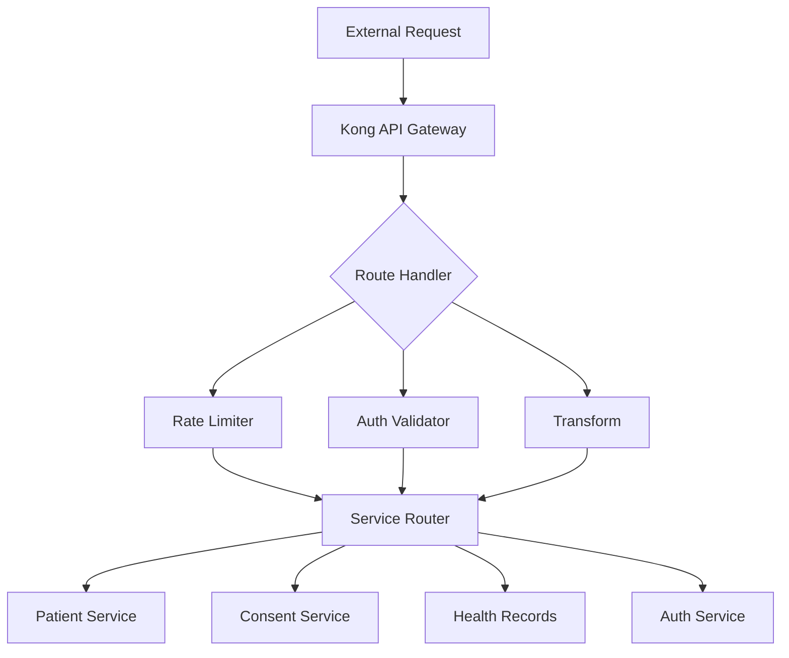

**Key Components**:
- Route definitions
- Rate limiting configuration
- Authentication middleware
- Request/Response transformation
- Service discovery integration
- Load balancing

### 2. Authentication Service

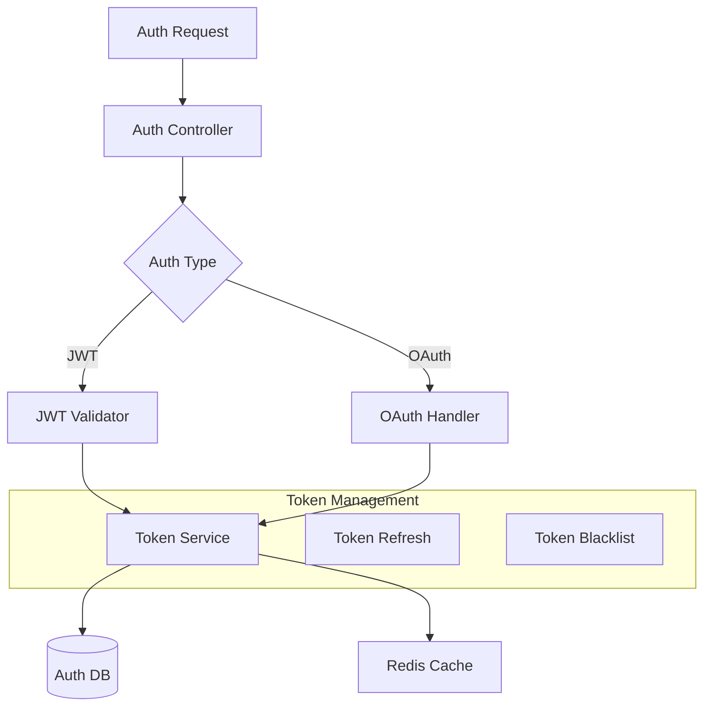

**Key Components**:
- Token management
- OAuth2.0 implementation
- Role-based access control
- Session management
- Audit logging

### 3. Patient Service

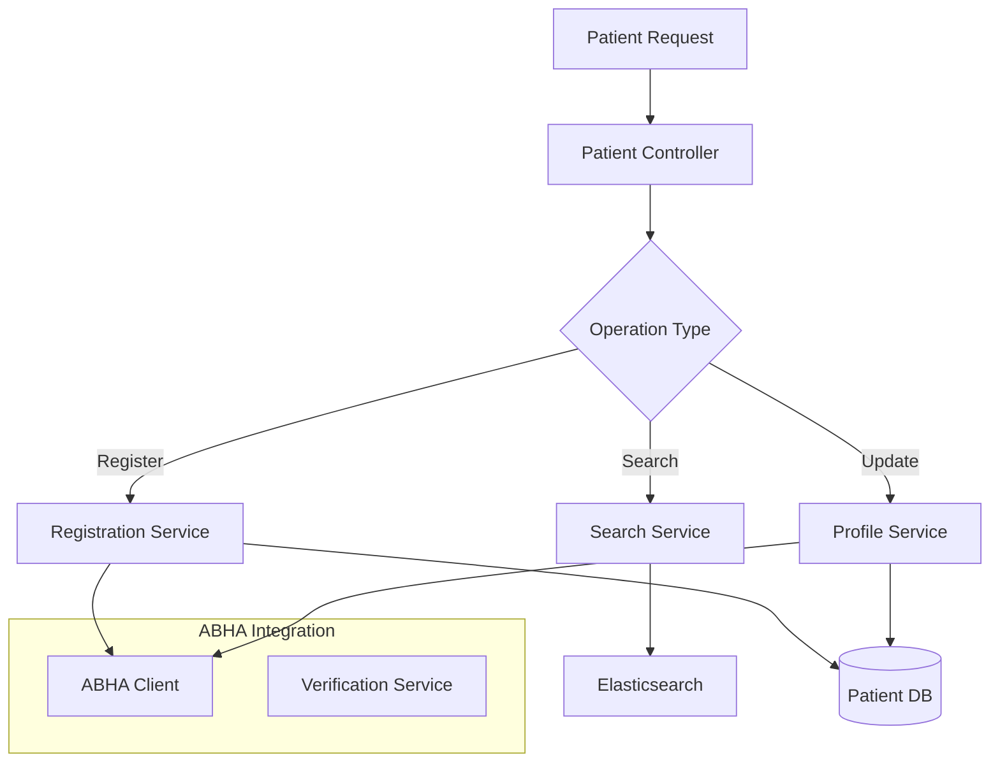

**Database Schema**:
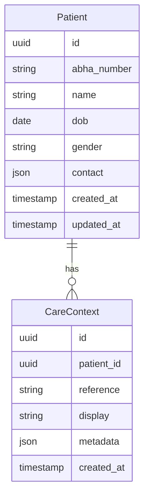

### 4. Consent Service

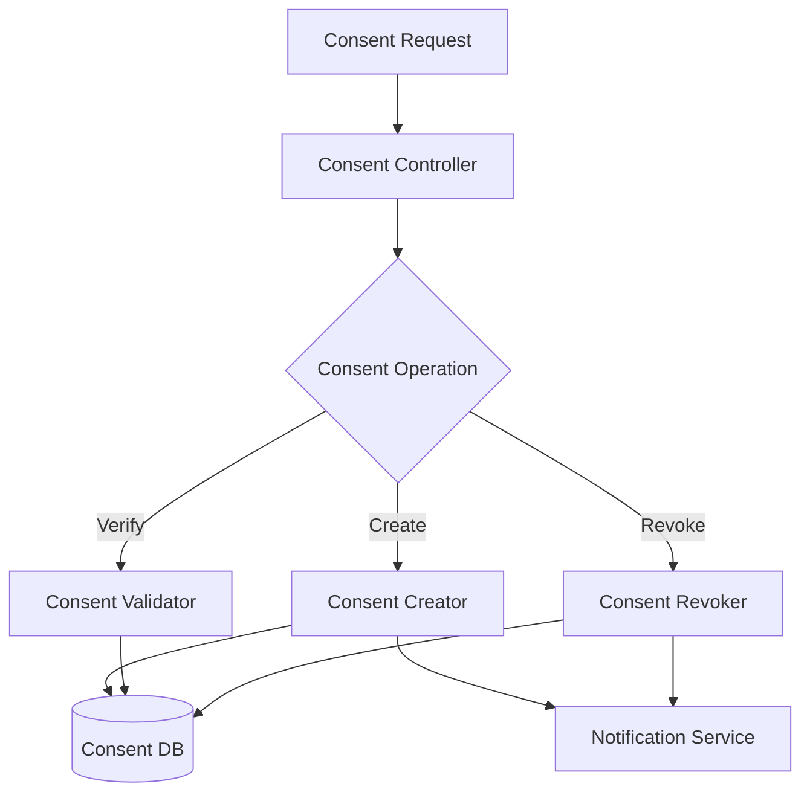

**Database Schema**:
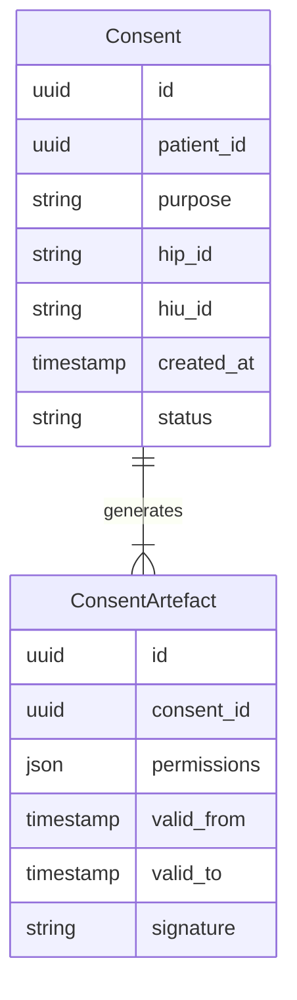

### 5. Health Records Service

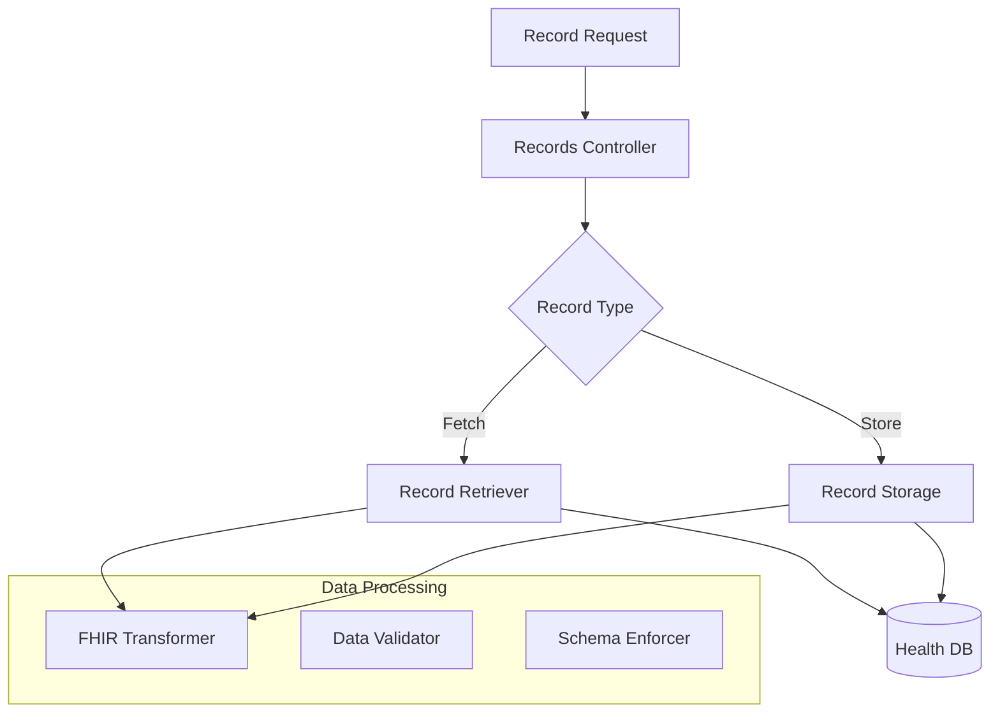

**Database Schema**:
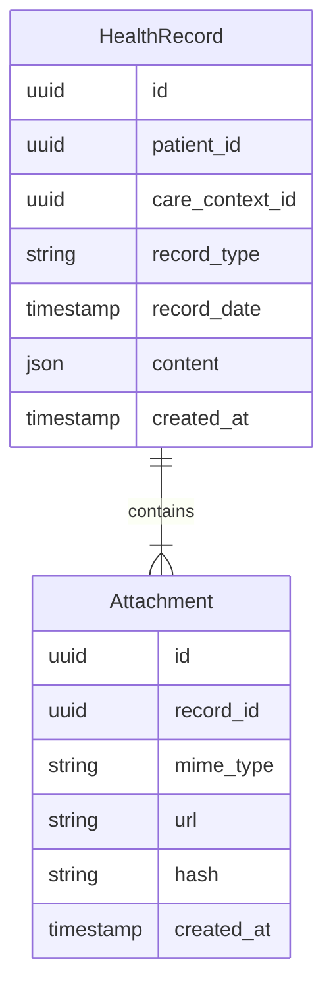

## Infrastructure Architecture

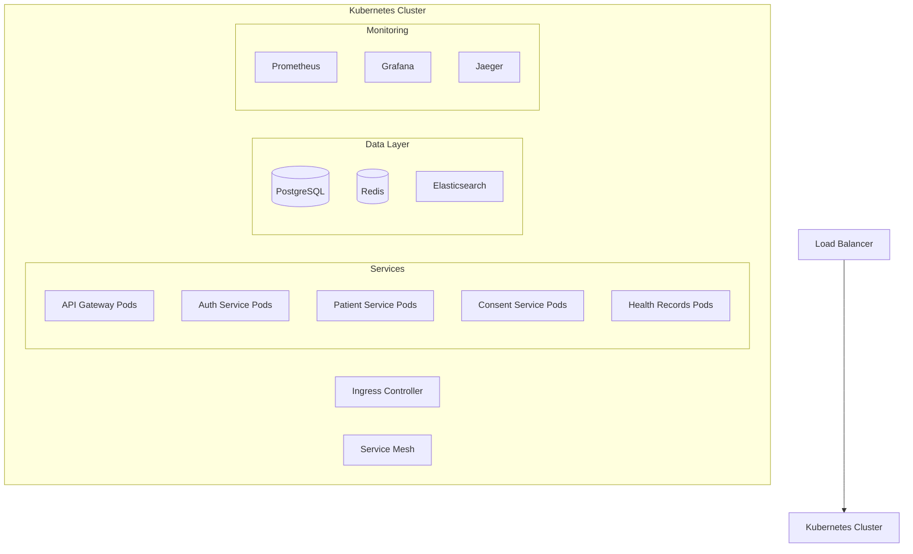

## Security Implementation

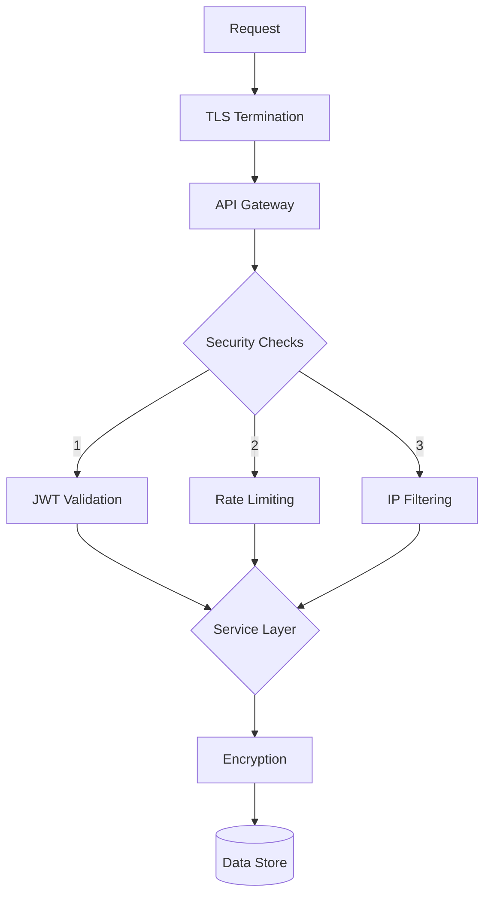

## Deployment Strategy

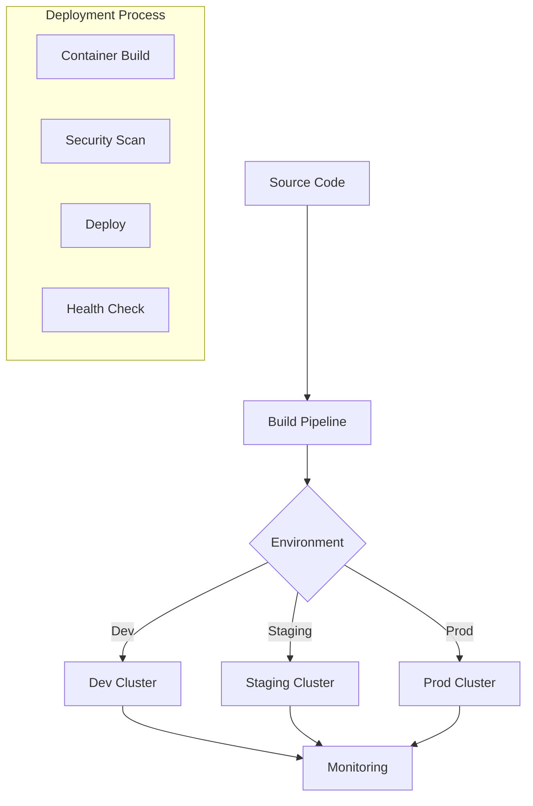

## Integration Points

### External Systems
1. ABDM Gateway
2. Hospital Information System
3. ABHA System
4. Consent Manager

### Internal Systems
1. Service-to-Service Communication
2. Data Synchronization
3. Event Broadcasting

## Performance Considerations

1. **Caching Strategy**
   - API Response Caching
   - Database Query Caching
   - Session Caching

2. **Database Optimization**
   - Connection Pooling
   - Query Optimization
   - Index Management

3. **Scalability**
   - Horizontal Scaling
   - Load Balancing
   - Resource Management 