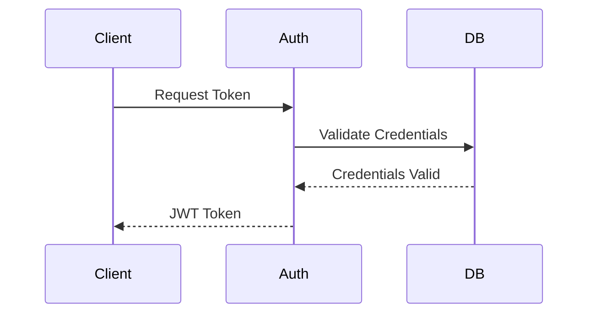
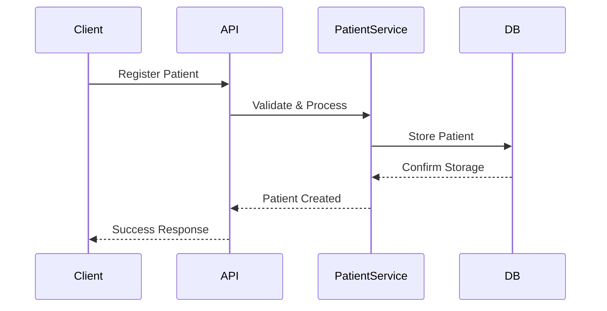
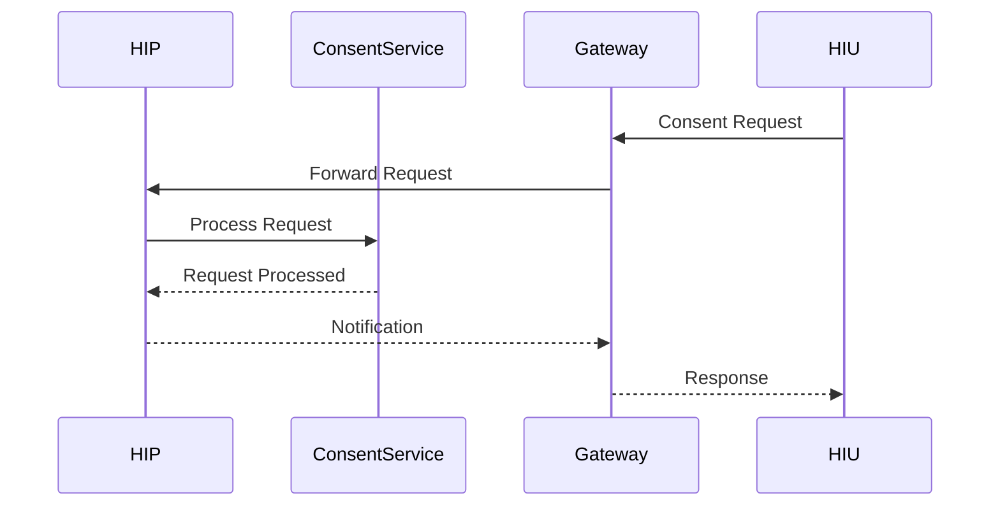
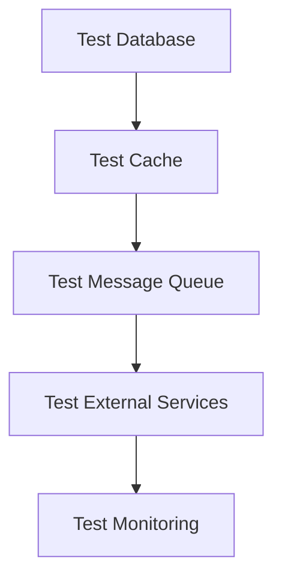
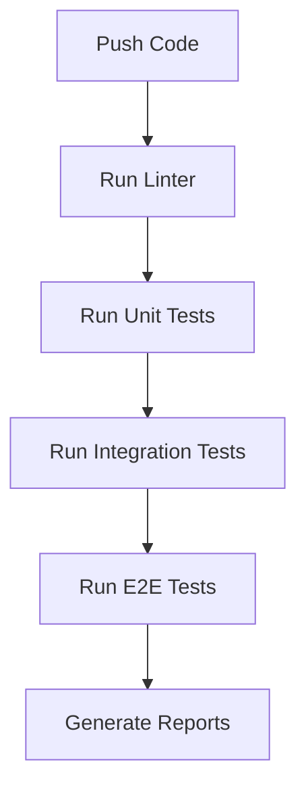

# Test Cases Documentation

## Overview

This document outlines the test cases for the HIP Mock System, covering unit tests, integration tests, and end-to-end tests.

## Test Categories

### 1. Unit Tests

#### Authentication Service
1. **Token Generation**
   - Test valid credentials generate token
   - Test invalid credentials return error
   - Test token expiry time
   - Test refresh token mechanism

2. **Token Validation**
   - Test valid token validation
   - Test expired token handling
   - Test malformed token handling
   - Test token signature verification

#### Patient Service
1. **Patient Registration**
   - Test valid patient registration
   - Test duplicate ABHA number handling
   - Test invalid data validation
   - Test required field validation

2. **Patient Search**
   - Test search by ABHA number
   - Test search by phone number
   - Test search with invalid parameters
   - Test no results scenario

#### Consent Service
1. **Consent Request**
   - Test valid consent request creation
   - Test invalid purpose code handling
   - Test date range validation
   - Test HI types validation

2. **Consent Artefact**
   - Test consent artefact creation
   - Test signature validation
   - Test expiry handling
   - Test revocation process

#### Health Records Service
1. **Record Storage**
   - Test valid record storage
   - Test invalid record format
   - Test attachment handling
   - Test duplicate record handling

2. **Record Retrieval**
   - Test retrieval with valid consent
   - Test retrieval without consent
   - Test date range filtering
   - Test HI type filtering

### 2. Integration Tests

#### Authentication Flow


1. **Complete Authentication Flow**
   - Test end-to-end token generation and validation
   - Test token refresh flow
   - Test token revocation

2. **Error Scenarios**
   - Test invalid credentials
   - Test expired tokens
   - Test malformed requests

#### Patient Management Flow


1. **Registration Flow**
   - Test complete patient registration
   - Test ABHA verification
   - Test duplicate handling

2. **Search Flow**
   - Test search with multiple parameters
   - Test pagination
   - Test sorting

#### Consent Management Flow


1. **Consent Request Flow**
   - Test consent request creation and notification
   - Test consent artefact generation
   - Test consent status updates

2. **Consent Validation Flow**
   - Test consent validation during health record access
   - Test expired consent handling
   - Test revoked consent handling

### 3. End-to-End Tests

#### Complete Patient Journey
1. **Patient Registration to Health Record Access**
   ```mermaid
   graph TD
       A[Register Patient] --> B[Add Care Context]
       B --> C[Create Consent Request]
       C --> D[Grant Consent]
       D --> E[Store Health Record]
       E --> F[Retrieve Health Record]
   ```
   - Test complete flow from registration to record retrieval
   - Test with multiple care contexts
   - Test with multiple consent requests

2. **Error Recovery Scenarios**
   - Test system recovery from network failures
   - Test partial transaction rollback
   - Test data consistency after errors

#### Performance Tests
1. **Load Testing**
   - Test system with 100 concurrent users
   - Test system with 1000 requests per minute
   - Test response times under load

2. **Stress Testing**
   - Test system at 200% normal load
   - Test recovery after overload
   - Test data consistency under stress

### 4. Security Tests

#### Authentication Security
1. **Token Security**
   - Test token encryption
   - Test token tampering detection
   - Test replay attack prevention

2. **Access Control**
   - Test role-based access
   - Test permission validation
   - Test resource isolation

#### Data Security
1. **Encryption Tests**
   - Test data encryption at rest
   - Test data encryption in transit
   - Test key rotation

2. **Privacy Tests**
   - Test data masking
   - Test audit logging
   - Test data access controls

## Test Data Management

### 1. Test Data Sets
- Patient test data
- Care context test data
- Consent test data
- Health record test data

### 2. Test Environment Setup


## Test Execution

### 1. Automated Tests
```bash
# Run all tests
npm run test

# Run specific test suites
npm run test:unit
npm run test:integration
npm run test:e2e

# Run with coverage
npm run test:coverage
```

### 2. Manual Tests
1. **Postman Collection Tests**
   - Import collection
   - Set environment variables
   - Execute test scenarios
   - Verify responses

2. **UI Tests**
   - Test responsive design
   - Test browser compatibility
   - Test accessibility

## Test Reporting

### 1. Coverage Reports
- Unit test coverage
- Integration test coverage
- Code coverage metrics

### 2. Test Results
- Test execution summary
- Error logs and analysis
- Performance metrics

## Continuous Integration

### 1. CI Pipeline


### 2. Quality Gates
- Minimum test coverage: 80%
- Zero critical test failures
- Performance benchmarks met 