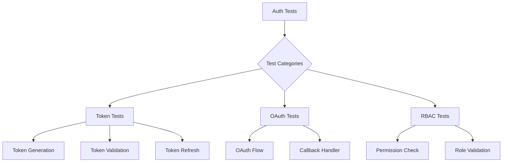
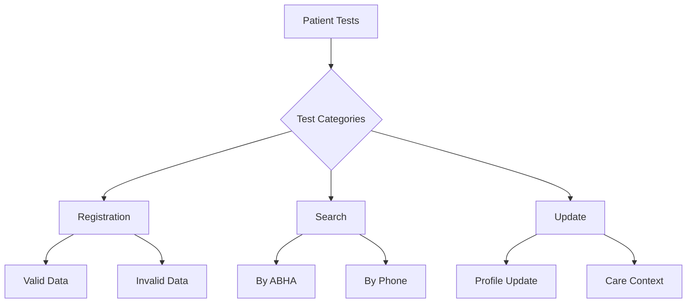
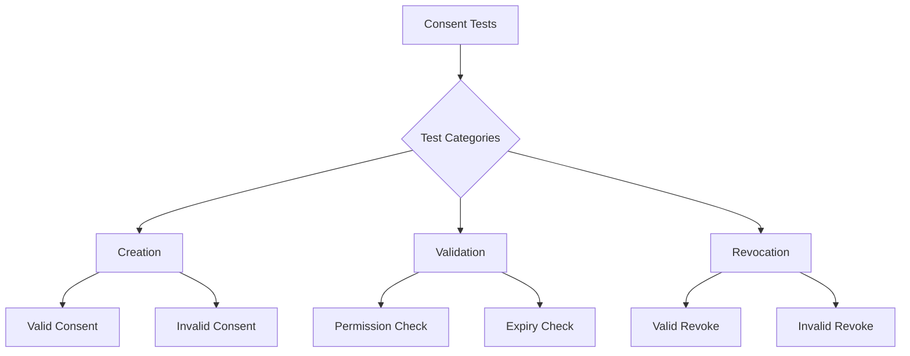
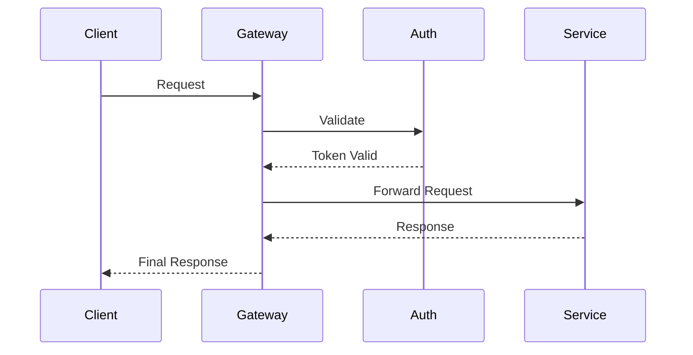
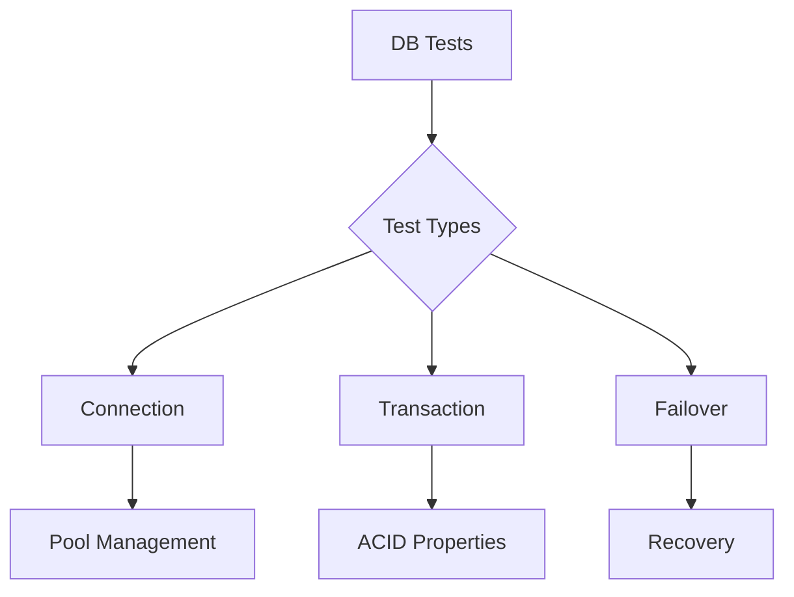
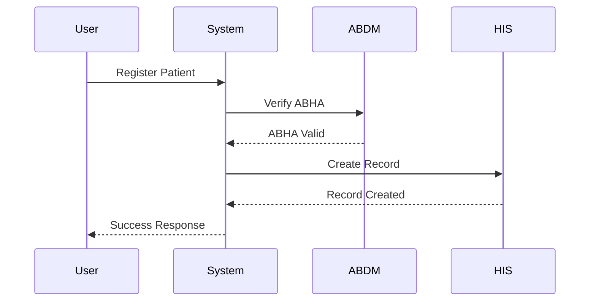
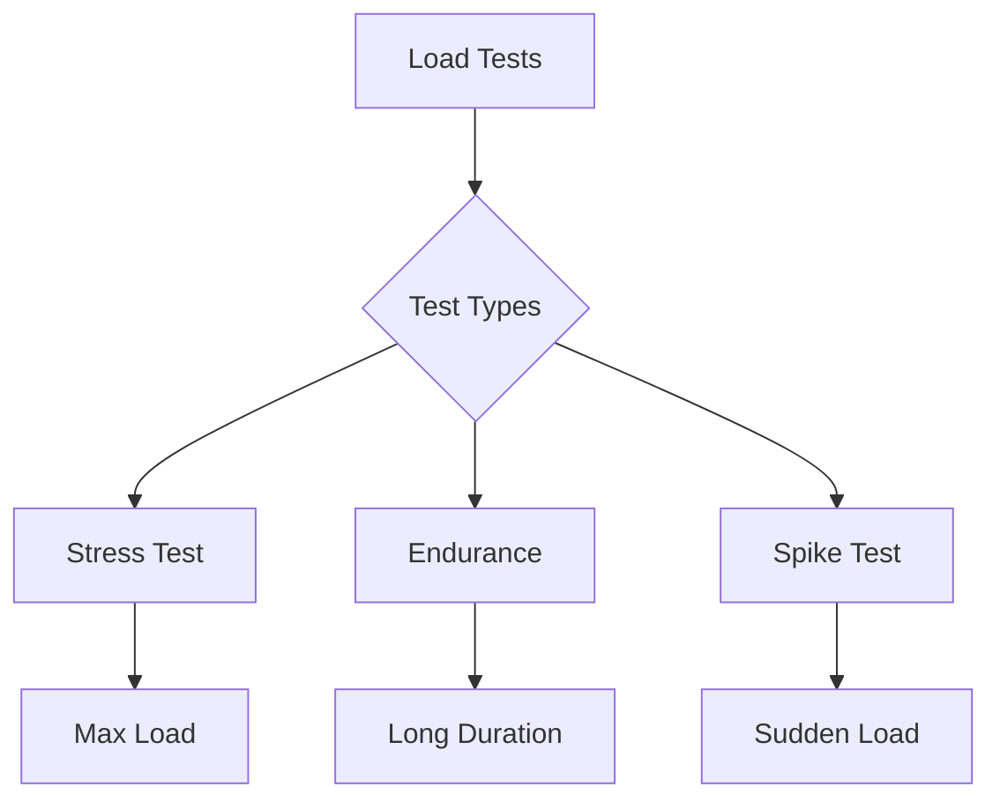
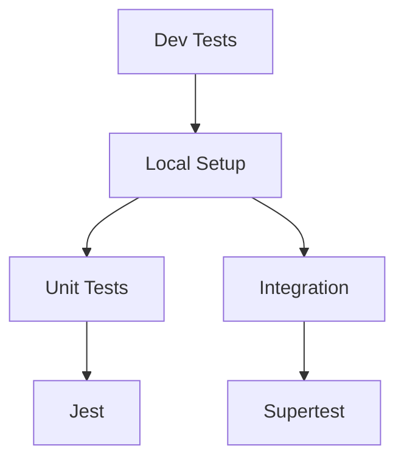
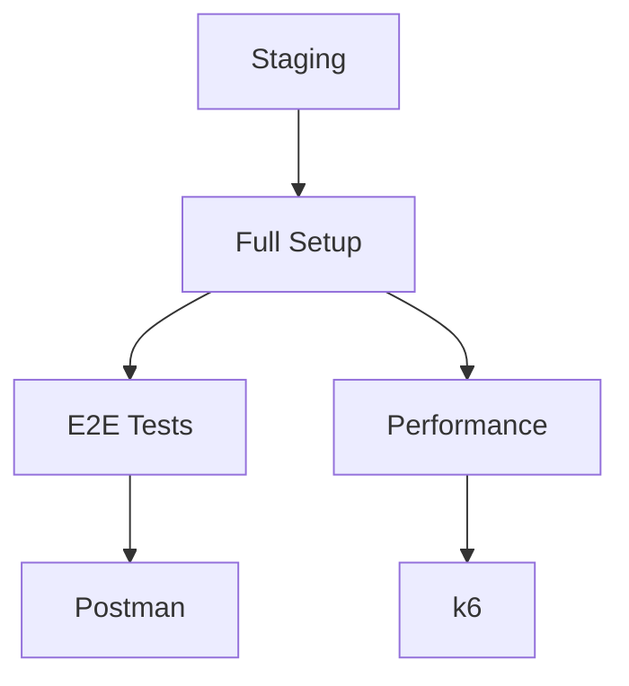
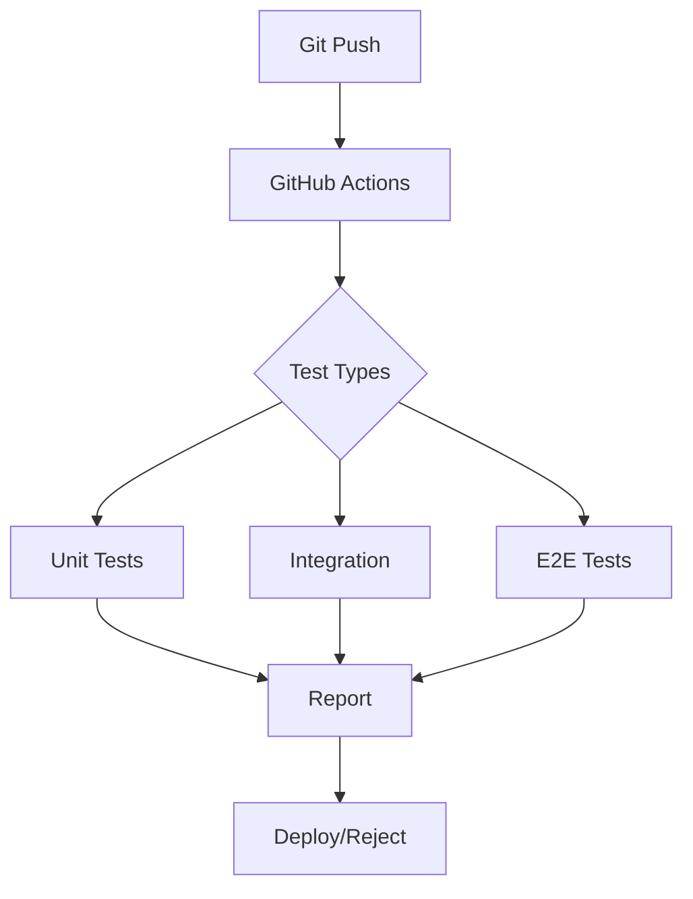

# Test Strategy Document

## Testing Levels

### 1. Unit Testing

#### Authentication Service Tests


**Test Cases**:
1. Token Management
   - Generate JWT token with valid payload
   - Validate token signature
   - Handle expired tokens
   - Refresh token flow
   - Token revocation

2. OAuth Flow
   - Authorization code flow
   - Token exchange
   - Scope validation
   - Error handling

#### Patient Service Tests


**Test Cases**:
1. Patient Registration
   - Valid patient registration
   - Duplicate ABHA handling
   - Invalid data validation
   - Required field validation

2. Patient Search
   - Search by ABHA number
   - Search by phone number
   - No results handling
   - Multiple results handling

#### Consent Service Tests


**Test Cases**:
1. Consent Creation
   - Valid consent creation
   - Invalid purpose handling
   - Date range validation
   - Permission scope validation

2. Consent Management
   - Consent status updates
   - Expiry handling
   - Revocation process
   - Notification triggers

### 2. Integration Testing

#### API Gateway Integration


**Test Scenarios**:
1. Request Flow
   - Valid request routing
   - Authentication flow
   - Rate limiting
   - Error handling

2. Service Communication
   - Inter-service communication
   - Data transformation
   - Error propagation

#### Database Integration


**Test Cases**:
1. Database Operations
   - CRUD operations
   - Transaction management
   - Concurrent access
   - Connection pooling

2. Cache Integration
   - Cache hit/miss scenarios
   - Cache invalidation
   - Cache synchronization

### 3. End-to-End Testing

#### Patient Flow


**Test Scenarios**:
1. Complete Patient Registration
2. Health Record Creation
3. Consent Management Flow
4. Data Sharing Flow

### 4. Performance Testing

#### Load Testing Scenarios


**Test Cases**:
1. Concurrent Users
   - 100 simultaneous users
   - 1000 requests per second
   - Response time monitoring

2. Data Volume
   - Large file handling
   - Bulk record processing
   - Search performance

## Test Environments

### 1. Development Environment


### 2. Staging Environment


## Test Data Management

### 1. Test Data Generation
- Synthetic patient data
- Mock health records
- Test consent artifacts

### 2. Data Cleanup
- Test data isolation
- Cleanup procedures
- Data reset mechanisms

## Postman Collection Structure

```json
{
  "info": {
    "name": "HIP Mock System Tests",
    "schema": "https://schema.getpostman.com/json/collection/v2.1.0/collection.json"
  },
  "item": [
    {
      "name": "Authentication",
      "item": [
        {
          "name": "Generate Token",
          "request": {
            "method": "POST",
            "header": [],
            "url": "{{baseUrl}}/auth/token"
          }
        }
      ]
    },
    {
      "name": "Patient",
      "item": [
        {
          "name": "Register Patient",
          "request": {
            "method": "POST",
            "header": [],
            "url": "{{baseUrl}}/patient/register"
          }
        }
      ]
    },
    {
      "name": "Consent",
      "item": [
        {
          "name": "Create Consent",
          "request": {
            "method": "POST",
            "header": [],
            "url": "{{baseUrl}}/consent/create"
          }
        }
      ]
    }
  ]
}
```

## Test Automation

### 1. CI/CD Integration


### 2. Test Reports
- Jest coverage reports
- Integration test results
- Performance metrics
- Error logs

## Security Testing

### 1. Security Test Cases
- Authentication bypass attempts
- Authorization validation
- SQL injection prevention
- XSS prevention
- CSRF protection

### 2. Compliance Testing
- ABDM compliance
- Data privacy
- Audit logging
- Access control

## Error Scenarios

### 1. Error Handling Tests
- Network failures
- Timeout scenarios
- Invalid data handling
- Service unavailability

### 2. Recovery Testing
- Service restart
- Data consistency
- Session recovery
- Cache rebuild

## Monitoring Tests

### 1. Metrics Validation
- Response times
- Error rates
- Resource usage
- Cache hit rates

### 2. Alert Testing
- Threshold alerts
- Error notifications
- System health alerts
- Performance alerts 